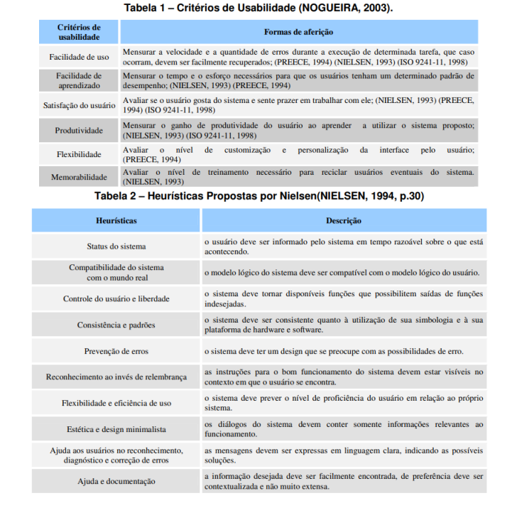

# **Sites avaliados**

## [_Governo do DF_](https://www.df.gov.br/)

> **_Aluno(a)_**: Kallyne Macêdo Passos  
> **_Matricula_**: 202046229

* A avaliação presente busca verificar critérios de usabilidade e heurística no site oficial do Governo do Distrito Federal (<https://www.df.gov.br/>). Para isso, serão definidas as tarefas de acessar os serviços destacados, mapa do site, funções de acessibilidade e deixar feedback, que devem ser realizadas através de um computador de uso pessoal com acesso à Internet, para que sejam respondidas as questões levantadas no Framework DECIDE.

* Conforme Maciel, Nogueira et. al (2004), no texto Avaliação Heurística de Sítios na Web, os critérios de usabilidade de um site e as heurísticas que podem ser avaliadas são conforme as tabelas a seguir:

* Em uma primeira navegação no site, observou-se um design minimalista, com cores conforme a identidade visual do Governo. Entretanto, o primeiro carrossel de imagens não oferece informações sobre as fotografias mostradas e o segundo carrossel da landing page exibe uma foto ou nenhuma foto, o que causa estranhamento ou confusão no usuário.

* Ao realizar a tarefa de acessar o mapa do site, foi notada facilidade em localizá-lo no rodapé da página. O mapa consiste em links de redirecionamento, dos quais seis estão quebrados. A aba de comunicar erros retorna void, ou seja, não acontece ação após o clique.

* Através do mapa, do menu principal e de um container na landing page, é possível chegar até a carta de serviços, buscando realizar a tarefa de acessar os principais serviços. Dos seis serviços destacados, quatro redirecionaram a páginas não existentes ou sem serviço. Nessa aba, também é observado que o menu “Ir para busca | Ir para o menu | Ir para o conteúdo | Ir para rodapé”, mantido junto da logo principal do site, aparece em todas as páginas, mas só funciona em notícias/conteúdo em formato textual padrão, que não é o caso da página de serviços.

* No rodapé, entretanto, verifica-se um redirecionamento para a “carta de serviços”, que é diferente da página acessada anteriormente. Nessa, verifica-se um container com quatro serviços principais, nos quais 3 estão com links quebrados, e o usuário é impedindo de acessar as informações de “Creche e pré-escola, endereços e telefones dos batalhões da PM e Orquestra Sinfônica do Teatro Nacional Cláudio Santoro” na página, pois o menu existente está travado em “Casa da Mulher Brasileira (CMB)”.

* A tentativa de utilizar serviços de acessibilidade obteve sucesso ao verificar a existência de uma ferramenta de inteligência artificial que acompanha o clique do usuário e “traduz” a informação em Libras. Além disso, o site possui opção de aumento de fonte e alteração de contraste.

* Para finalizar a avaliação, buscou-se deixar um feedback. A tentativa de comunicar erro foi falha, mas o link de acesso à Ouvidoria do DF se encontra funcional e conta com instruções para o registro da mensagem.

* Assim, obteve-se que o usuário não consegue visualizar todas as informações que deseja de forma clara, pois, apesar de ser fácil para o usuário o percurso até a informação desejada, muitos redirecionamentos enviam para páginas que contém só o título da informação desejada ou páginas não encontradas, impossibilitando-o de ter acesso ao conteúdo previsto. O mapa do site, por exemplo, pode ser utilizado, porém falha em redirecionar itens e comunicar erros. O design apresenta ferramentas de acessibilidade. Já no menu de serviços, o usuário não consegue acessar todas as opções e a opção de envio de feedback ou reclamações é realizada na página de Ouvidoria.

* Tendo em vista os objetivos de verificar a usabilidade do site, verificar se o design atende as necessidades do público alvo e se e como a plataforma gera consequências no contexto social, é possível concluir que o design compreende os objetivos de seu público-alvo, que busca enxergar no site um meio confiável de obter informações acerca de serviços, notícias e informações governamentais, mas não o atinge com excelência ao deixar muitas páginas inacessíveis. No contexto social, o estado atual da página que representa o governo do DF apresenta repetidos erros de usabilidade, o que causa frustração no usuário principal, o cidadão do Distrito Federal.

* Por fim, considerando a escala de Nielsen (MACIEL, NOGUEIRA et. al, 2004, p. 3) para classificar os problemas encontrados durante a inspeção da interface, observa-se que o site
apresenta erros de usabilidade considerados, em sua maioria, simples (pode ser reparado, com baixa prioridade de correção) ou grave (deve ser reparado, com alta prioridade de correção).

## Histórico de versão

| Versão |    Data    |                  Descrição                   |      Responsáveis      |    Revisor    |
| :----: | :--------: | :------------------------------------------: | :--------------------: | :-----------: |
|  1.0   | 29/09/2023 | Padronização de todas as avaliações de sites | [Pablo Guilherme](https://github.com/PabloGJBS), [Ester Lino](https://github.com/esteerlino) | [Suzane Duarte](https://github.com/suzaneduarte) |
|  1.1   | 02/10/2023 | Correção de imagem | [Ester Lino](https://github.com/esteerlino) | [Kallyne Macedo](https://github.com/kalipassos) |
