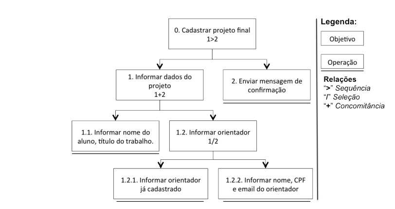
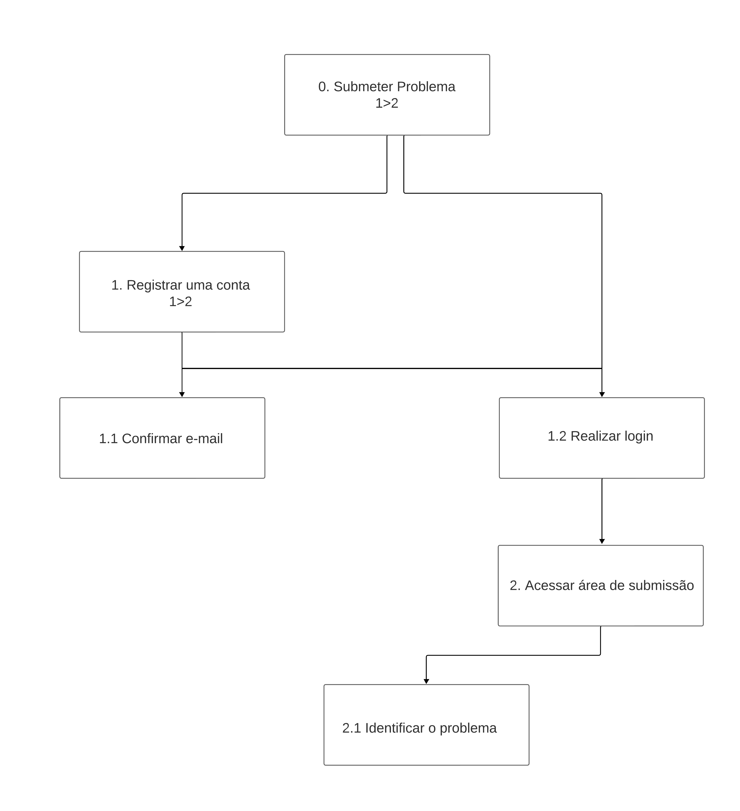

# Introdução - Análise de Tarefas

A análise de tarefas tem como finalidade proporcionar uma compreensão abrangente das atividades dos usuários, incluindo como as executam e os motivos por trás de suas ações. Nesse contexto, o trabalho é delineado em relação aos objetivos que os usuários buscam alcançar, seja por vontade própria ou por necessidade.

Dessa forma, para realizar a análise de tarefas deste projeto foram escolhidos dois métodos, sendo eles:

- Hierarchical Task Analysis (HTA);

- Goals, Operators, Methods and Selection Rules (GOMS);

# Análise Hierárquica de Tarefas

A análise Hierárquica de Tarefas (HTA - Hierarchical Task Analysis) visa compreender as competências e habilidades necessárias para a execução de tarefas complexas e não rotineiras, ao mesmo tempo que auxilia na detecção de problemas de desempenho. Ela facilita a conexão entre as ações das pessoas (ou o que é recomendado que façam), os motivos por trás dessas ações e as potenciais consequências de um desempenho inadequado.

Nessa técnica, é necessário identificar tarefas e objetivos. As tarefas referem-se a qualquer parte do trabalho que precisa ser realizado, enquanto o objetivo é um estado final específico definido por eventos ou valores observáveis em uma ou mais variáveis que atuam como critério de alcance do objetivo. Isto é, utiliza-se como base as tarefas a serem realizadas a fim de atingir um objetivo do usuário.

A listagem dessas tarefas precisa ser realizada com base nas propostas de notação textual e gráfica, conforme demonstrado na figura a seguir:

_Figura 1 - Exemplo de modelo HTA, adaptado de Barbosa & da Silva (2010)_

Essa notação, além de apresentar os objetivos também representa o conceito de operação, que é a representação das ações de entradas e saídas.

Abaixo é possível conferir as principais tarefas que um usuário procura utilizar através do Online Judge.

## Submeter problema

Nessa tarefa, o usuário possui o objetivo de submeter a solução de um determinado problema proposto. A Figura 2 apresenta o diagrama HTA relativa a essa tarefa, e a Tabela 1 representa o mesmo HTA em formato de tabela.

Figura 2 - Diagrama HTA para submissão de problemas.

<b>Fonte:</b> <a href="https://github.com/suzaneduarte">Suzane Duarte</a>, <a href="https://github.com/PabloGJBS">Pablo Guilherme</a>

Tabela 1 - HTA de submissão de problemas.

| Objetivo/Tarefa              | Descrição, Recomendações e Problemas                                                                                                                                                                                                        |
| ---------------------------- | ------------------------------------------------------------------------------------------------------------------------------------------------------------------------------------------------------------------------------------------- |
| 0. Submeter problema         |                                                                                                                                                                                                                                             |
| 1. Registrar uma conta       | **Input:** dados para o cadastro   **Feedback:** usuário visualiza mensagem para confirmar e-mail.   **Plano:** confirmar conta e depois fazer login                                                                                  |
| 1.1 Confirmar E-mail         | **Feedback:** após confirmar o e-mail, o usuário é liberado para realizar login                                                                                                                                                             |
| 1.2 Realizar login           | **Input:** dados de login  **Feedback:** usuário redirecionado para a página "Home"  **Plano:** abrir página de submissão em "Quick Submit"                                                                                           |
| 2. Acessar área de submissão | **Plano:** submeter a solução do problema                                                                                                                                                                                                   |
| 1.2 Identificar o problema   | **Input:** inserir ID do problema, linguagem utilizada e o referido código do problema  **Feedback:** a página é atualizada e o usuário recebe uma mensagem de submissão enviada  **Plano:** submeter a solução do problema escolhido |

<b>Fonte:</b> <a href="https://github.com/suzaneduarte">Suzane Duarte</a>, <a href="https://github.com/PabloGJBS">Pablo Guilherme</a>

## Procurar um problema

Nesta tarefa, o objetivo do usuário é buscar um novo problema para solucionar dentro do site. A Figura 3 apresenta o diagrama HTA relativa a essa tarefa, e a Tabela 2 representa o mesmo HTA em formato de tabela.

Figura 3 - Diagrama HTA para procurar problemas.

<b>Fonte:</b> <a href="https://github.com/suzaneduarte">Suzane Duarte</a>, <a href="https://github.com/PabloGJBS">Pablo Guilherme</a>

Tabela 2 - HTA de visualização de submissões.

| Objetivo/Tarefa                      | Descrição, Recomendações e Problemas                                                                                                |
| ------------------------------------ | ----------------------------------------------------------------------------------------------------------------------------------- |
| 0. Visulizar minhas submissões       | **Plano:** Visualizar minhas submissões no site                                                                                     |
| 1.1 Realizar login                   | **Input:** dados de login  **Feedback:** usuário redirecionado para a página "Home"  **Plano:** abrir página "My submissions" |
| 2. Acessar área de minhas submissões | **Input:** click do usuário na aba "My submissions"  **FeedBack:** Usuário redirecionado para a página "My submissions"          |

<b>Fonte:</b> <a href="https://github.com/suzaneduarte">Suzane Duarte</a>, <a href="https://github.com/PabloGJBS">Pablo Guilherme</a>
 -->

# Bibliografia

> BARBOSA, S. D. J.; SILVA, B. S. Interação Humano-Computador. Rio de Janeiro: Elsevier, 2011.

# Histórico de versão

| Versão |    Data    |            Descrição            |                                           Responsáveis                                            |                     Revisor                     |
| :----: | :--------: | :-----------------------------: | :-----------------------------------------------------------------------------------------------: | :---------------------------------------------: |
|  1.0   | 01/10/2023 | Introdução a Análise de Tarefas | [Suzane Duarte](https://github.com/suzaneduarte), [Pablo Guilherme](https://github.com/PabloGJBS) | [Kallyne Macedo](https://github.com/kalipassos) |
