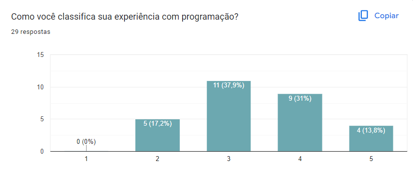
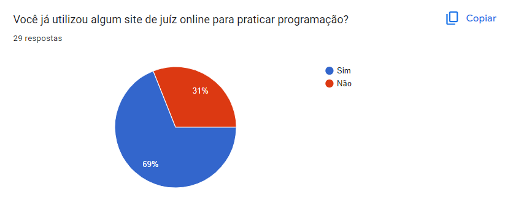
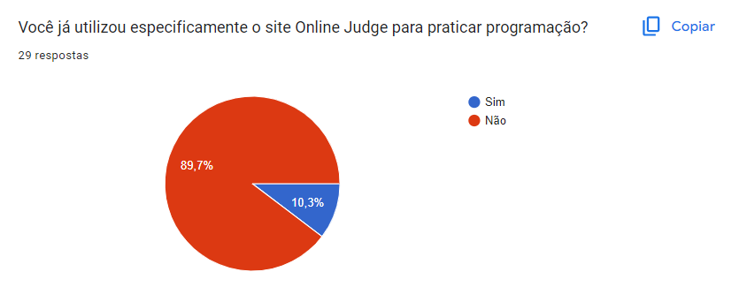
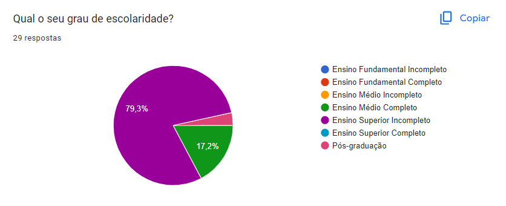
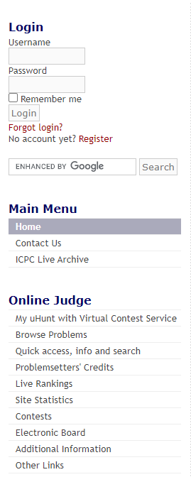
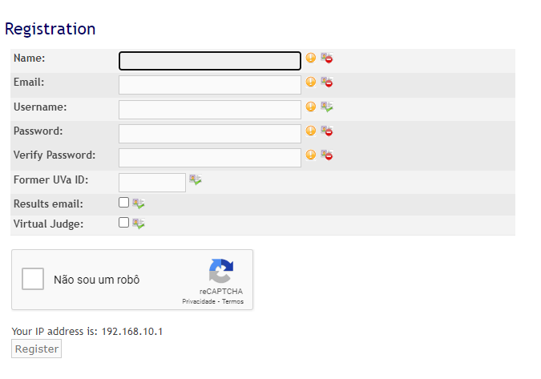
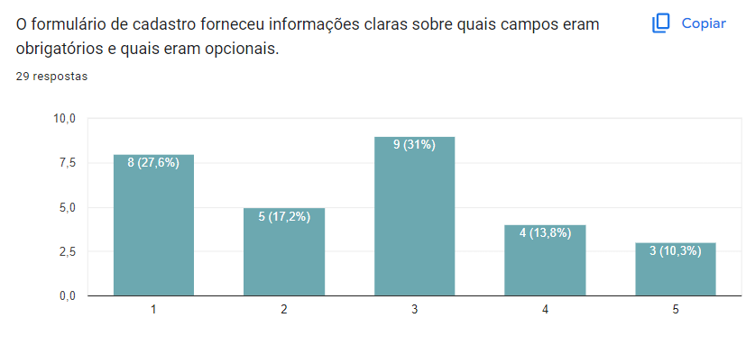
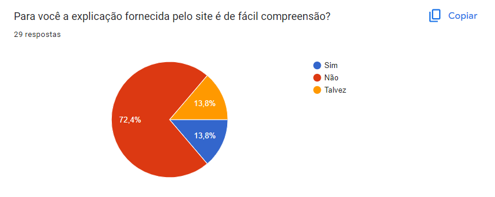

# **Perfil de Usuário**

## Introdução

Definir o perfil de usuário é uma etapa essencial no desenvolvimento do projeto, porque possibilita compreender quem são os indivíduos que utilizam o sistema. Segundo Barbosa e Silva, esse perfil descreve as características dos usuários, possibilitando entender quais são os objetivos que o sistema deve atender ao ser projetado. Essa abordagem auxilia no entendimento das necessidades, preferências e requisitos dos usuários, contribuindo para o desenvolvimento de um sistema mais eficaz e voltado para atender às suas demandas. <a id="anchor_1" href="#REF1">1</a>.

## Metdologia

Para elaborar o perfil de usuário foram utilizadas duas técnicas: questionário e entrevista. O questionário foi elaborado no Google Forms e possuía 15 questões que incluiam dados demográficos e informações sobre a experiência do usuário ao utilizar o site. O forms coletou respostas durante os dias 13/10/2023 e 15/10/2023. No artefato de aspectos éticos é apresentado o Termo de Consentimento. A entrevista foi realizada com dois usuários e conduzida pela integrante [Kallyne Macedo](https://github.com/kalipassos) é contava com 6 perguntas sobre a experiência com sites de juiz online e com o Online Judge.

## Dados coletados pelo questionário

**Pergunta 1:** Como você classifica sua experiência com programação?

 <figcaption align="center">Figura 1 - Respostas da 1ª pergunta.</figcaption>

<figcaption align="center">Autores: Página de resultados do Google Forms</figcaption> 

Ao analisar a Figura 1 é possível concluir que 44,6% possuem certa experiência na área de programação.

**Pergunta 2:** Você já utilizou algum site de juíz online para praticar programação?

 <figcaption align="center">Figura 2 - Respostas da 2ª pergunta.</figcaption>

<figcaption align="center">Autores: Página de resultados do Google Forms</figcaption> 

A Figura 2 mostra que 69% dos participantes do questionário já utilizaram sites de juiz online para treinar programação.

**Pergunta 3:** Você já utilizou especificamente o site Online Judge para praticar programação?

 <figcaption align="center">Figura 3 - Respostas da 3ª pergunta.</figcaption>

<figcaption align="center">Autores: Página de resultados do Google Forms</figcaption> 

De acordo com a Figura 3, cerca de 89,7% dos participnates nunca usaram o Online Judge.

**Pergunta 4:** Qual a sua idade?

 <figcaption align="center">Figura 4 - Respostas da 4ª pergunta.</figcaption>

<figcaption align="center">Autores: Página de resultados do Google Forms</figcaption> 

93,1% dos participantes estão entre a faixa etária de 19-24 anos de idade.

**Pergunta 5:** Sexo

 <figcaption align="center">Figura 5 - Respostas da 5ª pergunta.</figcaption>

<figcaption align="center">Autores: Página de resultados do Google Forms</figcaption> 

A quantidade de participantes do sexo feminino foi de 48,3% e do sexo masculino 51,7% (Figura 5).

**Pergunta 6:** Qual o seu grau de escolaridade?

 <figcaption align="center">Figura 6 - Respostas da 6ª pergunta.</figcaption>

<figcaption align="center">Autores: Página de resultados do Google Forms</figcaption> 

Cerca de 79,3% dos participantes possuem Ensino Superior Incompleto (Figura 6).

### **As perguntas 7, 8 e 9 se basearam na Figura 7, a qual mostra a tela inicial do site Online Judge.**

 <figcaption align="center">Figura 7 - Tela inicial do Online Judge.</figcaption>

<figcaption align="center">Autores: Página inicial do Online Judge.</figcaption> 

**Pergunta 7:** Ao acessar a tela inicial do site, há muitas informações ou propagandas que podem tornar a página confusa ou sobrecarregada.

 <figcaption align="center">Figura 8 - Respostas da 7ª pergunta.</figcaption>

<figcaption align="center">Autores: Página de resultados do Google Forms</figcaption> 

37,9% dos participantes concordaram totalmente com essa afirmação, de acordo com a Figura 8.

**Pergunta 8:** A estrutura visual do site, como a disposição de elementos, cores e fontes, segue as tendências atuais de design.

 <figcaption align="center">Figura 9 - Respostas da 8ª pergunta.</figcaption>

<figcaption align="center">Autores: Página de resultados do Google Forms</figcaption> 

10 dos 29 participantes do questionário, discordaram totalmente dessa afirmação (Figura 9).

**Pergunta 9:** A tela inicial fornece informações relevantes de forma clara, facilitando ao usuário encontrar determinada tarefa.
Por exemplo: realizar o cadastro no site.

 <figcaption align="center">Figura 10 - Respostas da 9ª pergunta.</figcaption>

<figcaption align="center">Autores: Página de resultados do Google Forms</figcaption> 

Cerca de 27,6% dos participantes tiveram uma opinião neutra sobre essa afrimação (Figura 10). 

### **A pergunta 10 se baseia na Figura 11, que mostra o menu de ações do site Online Judge.**

 <figcaption align="center">Figura 11 - Menu de ações e ferramentas do Online Judge.</figcaption>

<figcaption align="center">Autores: Menu do Online Judge.</figcaption> 

**Pergunta 10:** O menu de ações possui uma linguagem clara para todo tipo de usuário, independente se é da área de computação ou não.

 <figcaption align="center">Figura 12 - Respostas da 10ª pergunta.</figcaption>

<figcaption align="center">Autores: Página de resultados do Google Forms</figcaption> 

27,6% discordaram totalmente dessa afirmação (Figura 12).

### **As perguntas 11, 12 e 13 se baseiam na Figura 13, que mostra a tela de registro do site Online Judge.**

 <figcaption align="center">Figura 13 - Tela de registro do Online Judge.</figcaption>

<figcaption align="center">Autores: Tela de registro do Online Judge.</figcaption> 

**Pergunta 11:** O formulário de cadastro possui símbolos ou ícones de difícil compreensão.

 <figcaption align="center">Figura 14 - Respostas da 11ª pergunta.</figcaption>

<figcaption align="center">Autores: Página de resultados do Google Forms</figcaption> 

31% dos participantes concordaram com a afirmação da pergunta 11 (Figura 14).

**Pergunta 12:** O formulário de cadastro forneceu informações claras sobre quais campos eram obrigatórios e quais eram opcionais.

 <figcaption align="center">Figura 15 - Respostas da 12ª pergunta.</figcaption>

<figcaption align="center">Autores: Página de resultados do Google Forms</figcaption> 

31% dos participantes tiveram uma opnião neutra sobre a afirmação da pergunta 12 (Figura 15).

**Pergunta 13:** O site explica adequadamente o significado de termos e símbolos.

 <figcaption align="center">Figura 16 - Respostas da 13ª pergunta.</figcaption>

<figcaption align="center">Autores: Página de resultados do Google Forms</figcaption> 

31% dos participantes discordaram totalmente da afirmação da pergunta 13 (Figura 16).

### **A pergunta 14 se baseia na Figura 17, que o campo Former UVa ID presente na tela de cadastro do site Online Judge.**

 <figcaption align="center">Figura 17 - Campo Former UVa ID.</figcaption>

<figcaption align="center">Autores: Campo Former UVa ID (Online Judge).</figcaption> 

**Pergunta 14:** Para você a explicação fornecida pelo site é de fácil compreensão?

Tradução do texto presente na Figura 17: Antigo UVa ID: O ID (incluindo o check de 2 letras) que você está usando atualmente no sistema UVa Online Judge.  Usar &#39;00000&#39;  se você não tiver um.  As informações serão usadas em um futuro próximo para migrar suas submissões.  Isso não pode ser modificado após o registro, então, por favor, seja preciso.

 <figcaption align="center">Figura 18 - Respostas da 14ª pergunta.</figcaption>

<figcaption align="center">Autores: Página de resultados do Google Forms</figcaption> 

72,4% afirmaram que a explicação do site para o campo Former UVa Id não é de fácil compreensão.

**Pergunta 15:** Você tem algum comentário sobre sua experiência com o site Online Judge ou alguma sugestão de melhoria?

 <figcaption align="center">Figura 19 - Respostas da 15ª pergunta.</figcaption>

<figcaption align="center">Autores: Página de resultados do Google Forms</figcaption> 

Essa pergunta era opcional e tivemos duas respostas: "Não" e "Eu não usei, mas as imagens mostram algo ruim" (Figura 19).

## Referências Bibliográficas

> <a id="REF1" href="#anchor_1">1.</a> BARBOSA, S. D. J.; SILVA, B. S. Interação Humano-Computador. Rio de Janeiro: Elsevier, 2011.

## Histórico de versão

| Versão |    Data    |                  Descrição                   |         Responsáveis          |    Revisor    |
| :----: | :--------: | :------------------------------------------: | :---------------------------: | :-----------: |
|  1.0   | 15/10/2023 | Inicialização da página de perfil de usuário | [Ester Lino](https://github.com/esteerlino) | [Luana Torres](https://github.com/luanatorress) |
