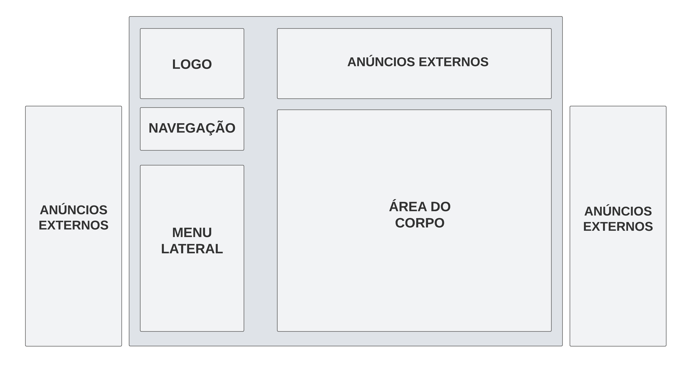
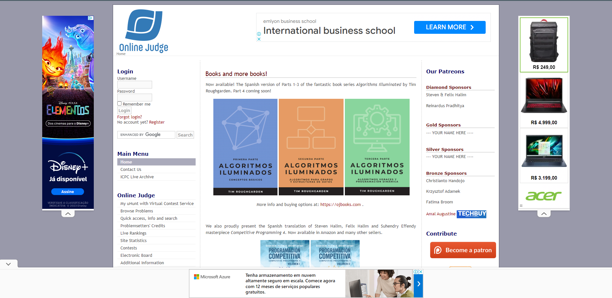
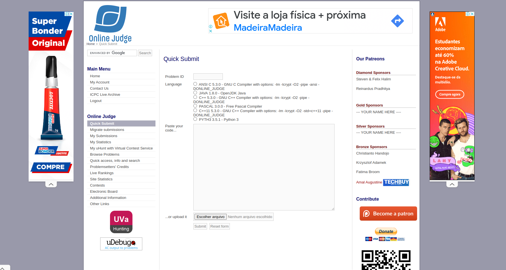
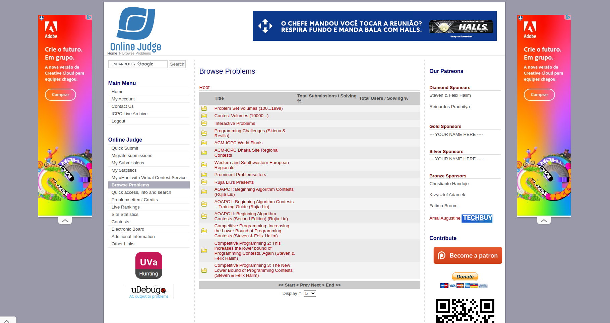

# **Guia de Estilo**

## 1. Introdução

O Guia de Estilo foi concebido de maneira a ser um guia de referência sobre a seleção e configuração de objetos de interação. Sendo assim, ele funciona como um registro das principais decisões de design, de forma que elas possam ser prontamente acessadas e aplicadas em discussões sobre possíveis expansões ou futuras versões do produto.

## 1.1 Objetivo, Organização e Conteúdo do guia de estilo

#### 1.1.1 OBJETIVO DO GUIA DE ESTILO

Este documento tem como finalidade a análise do estado pré-intervenção do design da interface do Online Judge. Após a compreensão dos princípios fundamentais que regem essa interface, o documento pretende servir como uma ferramenta de comunicação entre os membros da equipe de design e a equipe de desenvolvimento do produto final. Por fim, ele também é utilizado na implementação de fases intermediárias, como por exmeplo a prototipação.

#### 1.1.2 ORGANIZAÇÃO DO GUIA DE ESTILO

A organização desse guia de estilo seguirá a proposta estabelecida por Marcus<a id="anchor_1" href="#l1">¹</a> e Mayhew<a id="anchor_2" href="#l1">²</a>, a qual pode ser encontrada em Barbosa<a id="anchor_3" href="#l1">³</a>. Sendo ela:

- Introdução
- Resultados de análise
- Elementos de interface
- Elementos de interação
- Elementos de ação
- Vocabulário e Padrões
- Propostas de Intervenção

#### 1.1.3 PÚBLICO-ALVO DO GUIA DE ESTILO

Este guia de estilo foi criado a priori com o propósito de atender às necessidades de dois grupos principais: os estudantes da disciplina de Interação Humano-Computador envolvidos no projeto do Online Judge, e também a equipe de design do Online Judge que por ventura possam ter interesse no artefato.

#### 1.1.4 COMO UTILIZAR O GUIA DE ESTILO

Este guia de estilo se apresenta como um registro das principais decisões de design tomadas, de forma que elas não se percam, isto é, sejam efetivamente incorporadas no produto final. É importante que as decisões de design possam ser facilmente consultadas e reutilizadas nas discussões sobre extensões ou versões futuras do produto. Deste modo, este documento reune os princípios e as diretrizes adotados pelo site Online Judge.

#### 1.1.5 COMO MANTER O GUIA DE ESTILO

O guia de estilo é um artefato em constante evolução, a qual demanda uma manutenção regular para assegurar sua pertinência e eficácia contínuas. É essencial manter o guia atualizado e alinhado com o progresso do projeto, bem como com novas descobertas e entendimentos adquiridos ao longo do desenvolvimento e das interações com os usuários. Sendo assim, para garantir o que foi dito anteriormente, adotaremos práticas como atualizações regulares, utilização de práticas de versionamento e controle de alterações.

## 2. Resultados da Análise e Metodologia utilizada

#### 2.1 DESCRIÇÃO DO AMBIENTE DE TRABALHO DO USUÁRIO

A plataforma Online Judge é utilizada principalmente através de computadores. Isso porque, para realizar a submissão dos problemas é necessário que o código tenha passado pelo processo de compilação, ao qual infere-se que geralmente não é efetuado por dispositivos móveis. Dessa maneira, apesar dos usuários conseguirem acessar o site através do celular, é crucial dar destaque às particularidades dos dispositivos web durante o processo de design e desenvolvimento da interface do sistema. De forma a assegurar que ela proporcione uma experiência de usuário satisfatória e eficaz para aqueles que acessam a plataforma, envolvendo desde a adaptação de uma interface minimalista para diferentes tamanhos de tela, até a seleção de elementos visuais adequados.

## 3. Elementos de interface

#### 3.1 DISPOSIÇÃO ESPACIAL E GRID

O estilo de layout do Online Judge leva em consideração uma divisão em sessões, aos quais estão centralizados. A seguir, na Figura 1 é possível visualizar a disposição dos elementos da página principal do sistema.

Figura 1: Disposição dos elementos da página inicial

(Fonte: <a href="https://github.com/suzaneduarte">Suzane Duarte</a>) 

#### 3.2 JANELAS

O site oferece inúmeras janelas de navegação ao usuário, porém, pode-se destacar as principais, como a página inicial, a página de submissão de problemas e também a página para procurar novos problemas. As páginas citadas podem ser visualizadas a seguir respectivamente na Figura 2, Figura 3 e Figura 4.

Figura 2: Janela inicial

(Fonte: <a href="https://onlinejudge.org/">Online Judge, 2023</a>) 

Figura 3: Janela de submissão de problemas

(Fonte: <a href="https://onlinejudge.org/">Online Judge, 2023</a>) 

Figura 4: Janela para procurar problemas

(Fonte: <a href="https://onlinejudge.org/">Online Judge, 2023</a>) 

#### 3.3 TIPOGRAFIA

#### 3.4 SÍMBOLOS NÃO TIPOGRÁFICOS

#### 3.5 CORES

#### 3.6 ANIMAÇÕES

## 4. Elementos de interação

#### 4.1 ESTILOS DE INTERAÇÃO

#### 4.2 SELEÇÃO DE UM ESTILO

#### 4.3 ACELERADORES (teclas de atalho)

## 5. Elementos de ação

#### 5.1 PREENCHIMENTO DE CAMPOS

#### 5.2 SELEÇÃO

#### 5.3 ATIVAÇÃO

## 6. Vocabulário e Padrões

#### 6.1 TERMINOLOGIA

#### 6.2 TIPOS DE TELA

#### 6.3 SEQUÊNCIA DE DIÁLOGOS

## 7. Proposta de Intervenção

## Referências Bibliográficas

> <a id="l1" href="#anchor_1">1.</a> MARCUS, A. Graphic design for electronic documents and user interfaces. Association for Computing Machinery, New York, NY, USA, 1991.
>
> <a id="l2" href="#anchor_2">2.</a> MAYHEW, D. J. The Usability Engineering Lifecycle: A Practitioner’s Handbook for User Interface Design. Morgan Kaufmann, 1st edition edition, 1999.
>
> <a id="l3" href="#anchor_3">3.</a> BARBOSA, S. D. J.; SILVA, B. S. Interação Humano-Computador. Rio de Janeiro: Elsevier, 2011.

## Histórico de Versão

| Versão | Data       | Descrição                                         | Autor(es)                                        | Revisor(es)                                     |
| ------ | ---------- | ------------------------------------------------- | ------------------------------------------------ | ----------------------------------------------- |
| 1.0    | 22/10/2023 | Criação da página e organização do guia de estilo | [Suzane Duarte](https://github.com/suzaneduarte) | [Luana Torres](https://github.com/luanatorress) |
