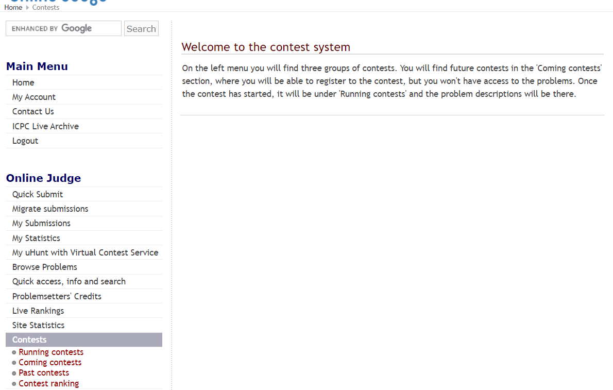

# **Princípios Gerais do Projeto**

## Introdução

No estudo da Interação Humano Computador, enquanto diretrizes demonstram regras observadas na prática, princípios indicam objetivos de alto nível. Os dois conceitos são aplicados para guiar o design conjuntamente com as atividades de análise <a id="anchor_1" href="#REF1">[1] </a>. Assim, neste artefato (desenvolvido por [Kallyne Macedo](https://github.com/kalipassos) e [Pablo Guilherme](https://github.com/PabloGJBS)), são listados os princípios e diretrizes gerais dos quais o projeto se baseia para que seus resultados sejam satisfatórios ao usuário.

## Metodologia

Para a visualização dos princípios gerais a serem considerados e empregues no projeto, as seções correspondentes a cada tópico foram dividas em definição, que busca apresentar o conceito e o contexto do princípio, e em aplicação, que observa no OnlineJudge se estão presentes ou não os critérios levantados. 

## Correspondência com as expectativas do usuário

#### Definição

Corresponder às expectativas do usuário, para Norman <a id="anchor_4" href="#REF4">[4]</a>, consiste em garantir que o sistema permita que usuário seja capaz de relacionar: 

- Ações e intenções possíveis; 
- Ações e seus efeitos no sistema; 
- Estado real do sistema e o sensorial do usuário; 
- Estado percebido do sistema e as necessidades do usuário. 

#### Aplicação

A plataforma OnlineJudge falha em exibir os critérios de correspondência com as expectativas do usuário. Por exemplo, ao longo do site, botões de envio de informação, embora funcionais, aparecem em tom de cinza apagado e não demonstram ser clicáveis, o que induz o usuário a entender que o botão está desativado, como visto na figura abaixo:

Figura 1: Botões search, update e cancel apagados. 
 
Fonte: <a href="https://onlinejudge.org/index.php?option=com_comprofiler&Itemid=3&task=userDetails">OnlineJudge</a>, 2023. 

## Simplicidade nas estruturas das tarefas

#### Definição

Esse princípio recomenda a simplificação de tarefas complexas de forma a minimizar a demanda por planejamento e pela solução de problemas decorrentes, seguindo quatro abordagens <a id="anchor_1" href="#REF1">[1]</a>: 
- Garantir que a tarefa permaneça igual, mas com insumos para sua aprendizagem pelo usuário;  
- Uso de tecnologia para manter o usuário como controlador da tarefa; 
- Automatização da tarefa, de maneira com que continue idêntica; 
- Modificação da natureza da tarefa.

#### Aplicação

No site OnlineJudge, o princípio da simplicidade é atingido parcialmente no menu lateral esquerdo, no qual são notadas abas que redirecionam a páginas centrais da plataforma. Entretanto, na aba "Contests", por exemplo, o clique direciona o usuário a uma página explicativa que não apresenta atalhos para os subtópicos relacionados; estes aparecem como novidade no menu lateral.

Figura 2 - Página Contest 
 
Fonte: <a href="https://onlinejudge.org/index.php?option=com_comprofiler&Itemid=3&task=userDetails">OnlineJudge</a>, 2023. 

## Equilíbrio entre controle e liberdade do usuário

#### Definição

O usuário deve sempre estar no controle do sistema para que possa aprender rapidamente, porém devem ser aplicadas restrições para que a relação usuário-sistema se mantenha equilibrada e o usuário não se sinta sobrecarregado com opções. 

#### Aplicação

O usuário tem tanto o controle como a liberdade limitados na plataforma. O módulo de acesso rápido e informações está quebrado, enquanto os menus de visualização dos desafios ("contests") apresentam pouca ou nenhuma ferramenta de busca ou filtragem.

Figura 3 - Página Past Contests 
 
Fonte: <a href="https://onlinejudge.org/index.php?option=com_comprofiler&Itemid=3&task=userDetails">OnlineJudge</a>, 2023. 

## Consistência e padronização / promoção da eficiência do usuário

#### Definição

Conforme Norman <a id="anchor_4" href="#REF4">[4]</a>, o projeto conceitual do sistema e a interface devem estar coerentes e consistentes entre si para que seja possível ao usuário a aprendizagem. Dessa forma, é ressaltada a importância da padronização das ações, seus resultados, layout dos diálogos e das visualizações de informações para que não se gere estranhamento no usuário. 

#### Aplicação

Há, na página de edição de perfil, uma discrepância com o botão de editar quando comparado com os outros botões já exibidos anteriormente, pois este se mostra em formato moderno e responsivo às ações do usuário. 
No geral, o layout do OnlineJudge se mostra coerente e padronizado.

Figura 4 - Botão search e edit 
 
Fonte: <a href="https://onlinejudge.org/index.php?option=com_comprofiler&Itemid=3&task=userDetails">OnlineJudge</a>, 2023. 

## Antecipação das necessidades do usuário

#### Definição

Quando o usuário for utilizar o sistema, ele deve ter todas as informações necessárias para realizar sua tarefa no momento sem que tenha a necessidade de pedir ao sistema informações. A partir disso, o sistema deve também antecipar as situações com maior probabilidade de ocorrerem para aumentar, por fim, a responsividade do sistema.

## Visibilidade e reconhecimento

#### Definição

Antes do usuário realizar uma ação no sistema ele deve ter a visão prévia de como esta ação pode ser realizada a partir de possiveis dicas e informações sobre sua tarefa, sendo assim o sistema deve apresentar informações utéis para o usuário no momento em que ele for realizar sua tarefa facilitando a utilização do sistema e reduzindo o tempo necessário para a tarefa.

## Conteúdo relevante e expressão adequada

#### Definição

Para este tópico, temos quatro máximas a serem seguidas <a id="anchor_6" href="#REF6">[6]</a>:

- Máxima da qualidade: não se deve realizar especulações ou proferir mentiras;
- Máxima da quantidade: a quantidade de informação deve respeitar um limite imposto pelos objetivos da conversa;
- Máxima da relação ou relevância: tudo o que for comunicado deve ter relação explícita e relevante ao tópico em questão;
- Máxima de modo ou clareza: as conversas devem ser precisas e sem excesso.

## Projeto para erros

#### Definição

Neste tópico é necessário considerar que tanto o sistema quanto quem o utiliza pode cometer algum erro duranta a execução de alguma tarefa, sendo assim o sistema deve ter medidas para premeditar erros que podem ocorrer e caso o erro ocorra o sistema deve informar ao usuário o que ocorreu e se possivel a reversão do erro o sistema deve dar as informações corretas para o usuário reverter o erro. Além disto caso o sistema possua a possibilidade de ações irreversíveis estas devem necessitar de uma confirmação persistente do usuário.

## Referências bibliográficas

> <a id="REF1" href="#anchor_1">1.</a>BARBOSA, S. D. J.; SILVA, B. S. Interação Humano-Computador. Rio de Janeiro: Elsevier, 2011. 
> <a id="REF3" href="#anchor_3">3.</a> COOPER, Alan. The Inmates Are Running the Asylum: Why High Tech Products Drive Us Crazy and How to Restore the Sanity (2nd Edition). Sams Publishing, 1999. 
> <a id="REF4" href="#anchor_4">4.</a> NORMAN, Don. The Psychology Of Everyday Things. Basic Books, New York, illustrated edition, 1988. 
> 5. Princípios Geral Bilheteria Digital. Disponível em: <https://interacao-humano-computador.github.io/2023.1-BilheteriaDigital/>. Acesso em 20 de outubro de 2023. 
<a id="REF6" href="#anchor_6">6.</a> REEVES, Byron e NASS, Clifford. The Media Equation: How People Treat Computers, Television, and New Media Like Real People and Places. Cambridge University Press/CSLI, Stanford, Calif, new edition, 1996. 

## Histórico de versão

| Versão | Data       | Descrição                                       | Autor(es)                                                                                     | Revisor(es)                                      |
| ------ | ---------- | ----------------------------------------------- | --------------------------------------------------------------------------------------------- | ------------------------------------------------ |
| 1.0  | 21/10/2023 | Criação da página da página princípios gerais | [Pablo Guilherme](https://github.com/PabloGJBS) | [Kallyne Macedo](https://github.com/kalipassos) |
| 1.1  | 22/10/2023 | Princípios de correspondência, simplicidade, equilíbrio e consistência; Ajustes gerais  | [Kallyne Macedo](https://github.com/kalipassos) | [Ester Lino](https://github.com/esteerlino) |
